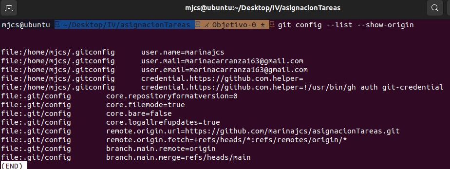

# asignacionTareas

## Problema planteado

Un grupo de estudiantes que viven en un piso compartido, con diferente disponibilidad horaria (ya que algunos están ocupados durante ciertos momentos del día), tienen dificultades a la hora de coordinar las tareas domésticas de cada día de la semana de forma equitativa. Pues normalmente algunos terminan colaborando poco, y otros se ven obligados a realizar el doble de trabajo.

